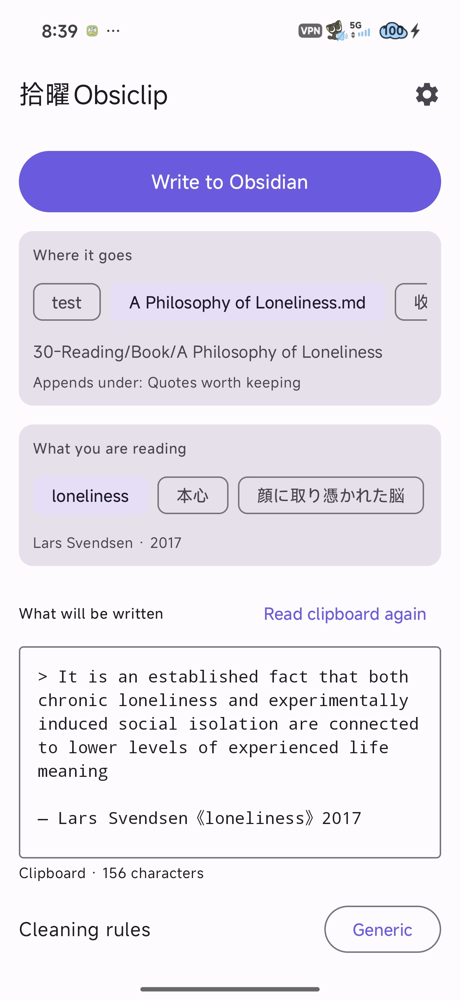
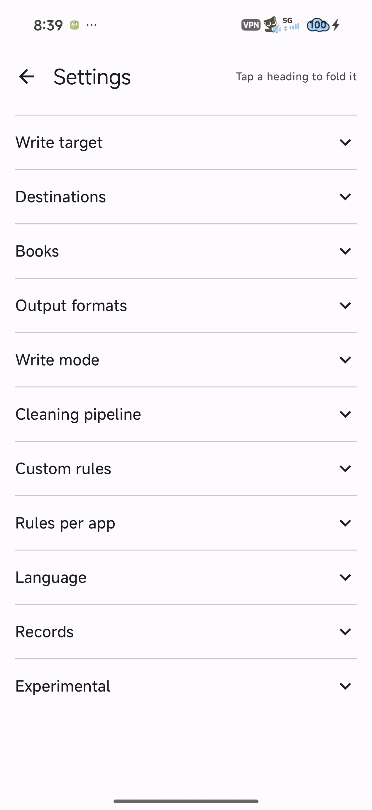
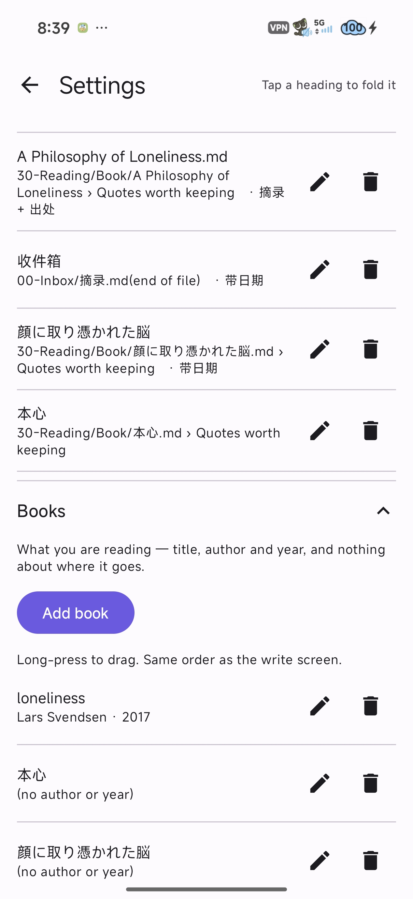
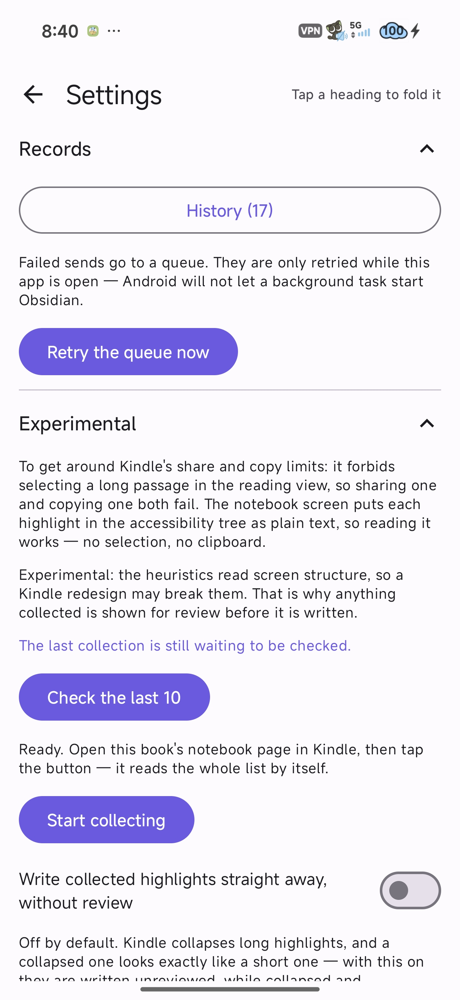

# 拾曜Obsiclip

> **English** · [中文](README.zh.md)

An Android share bridge for **any app**: share a highlighted passage or an entire note, and Obsiclip automatically strips junk formatting, wraps the text in your custom Markdown template, and appends it directly to the exact note and heading inside your Obsidian vault.

Works with any app capable of sharing text: reading apps (Readest, Kindle, Moon+ Reader, etc.), note-taking apps, browsers, and chats. It also plugs into the system text-selection menu under **"Process text"** — letting you capture text you highlighted directly without opening a share dialog. While Obsidian's official share target only dumps a standalone new note into the vault root, Obsiclip gives you full control over **which note**, **which section**, and **what format**.

**Kindle is the only app requiring specialized workarounds**, because it strictly blocks sharing or copying long passages in its reader screen — see [Clipboard workarounds](#when-a-share-dialog-refuses-common-with-kindle) and [Importing from Kindle's notebook screen](#experimental-importing-from-kindles-notebook-screen). These are dedicated solutions for one app's restrictions, not extra hurdles for normal use.

The interface is bilingual in **English and 简体中文** — it follows your device language by default and can be overridden in **Settings → Language**.

---

|  |  |  |  |
| :---: | :---: | :---: | :---: |

## What It Does

Reading apps almost always clutter your highlights with unwanted boilerplate: share preambles, store purchase links, and "read more" promotions. Obsiclip runs a clean, multi-step pipeline:

1. **Strips promotional clutter** — Automatically deletes opening share intros (`"In ...'s book ... I read..."`), store links, lines containing nothing but URLs, and `"label + link"` promotional footers. Only the genuine quote remains.
2. **Rejoins hard-wrapped lines** — Reconnects sentences split across multiple lines by EPUB/PDF screen layout (no space added for CJK characters, single space for Latin text, automatically rejoining hyphenated words). Intentionally formatted lists and headings are protected and left intact.
3. **Applies Markdown templates with live preview** — Formats quotes cleanly (e.g. `> 「僕にはまだ、お母さんが必要なんだよ。」`) along with book metadata (`> — 平野啓一郎《本心》 #reading`). You can edit the text freely right before sending.
4. **Writes cleanly via `obsidian://`** — Handled via URI calls so Obsidian itself performs the file writes. This keeps your internal wiki links, graph caches, and search indexes completely intact without touching files directly behind Obsidian's back.

> [!NOTE]
> **Book titles are never guessed automatically.** Trying to extract book titles from shared text sounds clever until it misreads one, filing your excerpt into a brand-new duplicate note right next to the real one. Instead, Obsiclip **strictly separates the destination note from the book metadata**: configure a book once (title, author, year), and let your destination rules decide where the excerpt lands.

---

## Usage

Share text from any app, or highlight text and choose **"Process text" → 拾曜Obsiclip** from the pop-up toolbar. The interface is arranged from top to bottom:

- **Write to Obsidian button** — Positioned right below the top bar. Text is usually cleaned and formatted the moment you open the app, so you can submit with a single tap without scrolling.
- **Where it goes (Destination buttons)** — A horizontal row of destination buttons. Paths support dynamic placeholders like `{title}`, so a single `"Book Notes"` destination works for every book you read. Shows the resolved target note path and heading.
- **What you're reading (Book buttons)** — A second row of buttons for your active reading list. Stores only metadata (title, author, year) and does not dictate where files are stored.
- **Drag-and-drop reordering** — Both rows of buttons (and their lists in Settings) can be **reordered by long-pressing and dragging**. The display order stays in sync across the app.
- **Preview & edit area** — Shows the final Markdown text that will be sent to Obsidian. Any manual edits you type in stick until you switch to a different destination or book.
- **Cleaning rule toggles** — Quick switches at the bottom for instant rule tweaks. Base configuration (like write mode) lives in Settings as a set-once preference.

*(Note: "Create note skeleton" is available inside the `+` dialog when adding a book. It clearly shows the path that will be created to prevent write failures — do not check this if the note already exists in your vault.)*

### When a Share Dialog Refuses (Common with Kindle)

Kindle's built-in share feature flatly rejects selections that are too long. Obsiclip provides three clipboard-based routes, ordered by convenience:

1. **Quick Settings tile** — Pull down your Android notification shade, tap the **Obsiclip** tile, and your copied text is pulled straight into the app.
2. **Auto-read on open** — Opening Obsiclip from your home screen automatically reads your clipboard (can be toggled in Settings).
3. **Manual "Read clipboard" button** — Tap the button inside the app anytime.

All three share the exact same routine: select text in your reader → tap **Copy** → return to Obsiclip. Copying in Kindle is also noticeably cleaner than sharing — it skips the promotional intro and store links entirely.
*(Note: Android 10+ restricts clipboard access to the currently focused app, which is why an explicit tap is required.)*

### One-Tap Direct Share Shortcuts

Saved destinations automatically show up as **Direct Share shortcuts** at the top of Android's system share sheet. Tapping one writes directly into Obsidian **without opening the Obsiclip app at all** (reusing whichever book you last selected).

### Experimental: Importing from Kindle's Notebook Screen

Kindle forbids selecting long passages in its main reading screen, so both sharing and copying fail. However, on Kindle's **Notebook / Highlights** screen, **every highlight is exposed in Android's accessibility tree as readable plain text**. Reading this tree bypasses selection limits completely without needing copy-paste.

**Settings → Experimental → Start collecting** → Switch to Kindle and open the book's Notebook page → Obsiclip smoothly scrolls to the bottom and reads every highlight → Review the results via the system notification or in Settings.

- **Requires Accessibility permission**, granted manually in Android settings. The service is strictly sandboxed to Kindle (`com.amazon.kindle`) and cannot observe any other application.
- **Review before writing by default.** Kindle collapses long highlights in list view, and collapsed excerpts look identical to short ones. To avoid silent truncation, entries that look truncated or are already present in your note are left unchecked by default.
- **Experimental feature.** Page parsing relies on Kindle's current UI structure; an upstream visual redesign from Amazon may break collection rules.

---

## Writing to Obsidian

Two URI pathways are supported, both verified on real devices:

| Feature / Behavior | Advanced URI (Default & Recommended) | Built-in URI |
| :--- | :--- | :--- |
| **Requires community plugin** | Yes ([Advanced URI](https://github.com/Vinzent03/obsidian-advanced-uri)) | No |
| **Append to a specific heading** | ✅ Appends directly under your chosen section | ❌ Appends to the very end of the file only |
| **Long text handling** | Automatically falls back to clipboard (>16k chars) | Automatically falls back to clipboard (>16k chars) |
| **Completion callback (`x-success`)** | ✅ Supported on mobile | ❌ Not supported on mobile |

> [!WARNING]
> **Two undocumented traps discovered through real device testing:**
> 1. Obsidian's built-in URI **without `append=true` is a silent no-op on existing files** — no error is raised, and nothing is written.
> 2. Advanced URI **silently does nothing when the target heading does not exist** (it will not even trigger `x-error`). For brand-new books, always ensure the note skeleton with the proper heading exists first.

---

## Settings

Settings sections are neatly grouped and collapsible (collapsed by default):

- **Destinations** — Set target note path, target heading, formatting template, and default inbox. Paths support template tags like `{title}`.
- **Books** — Manage book metadata: title, author, and year.
- **Output Formats** — Default output template plus custom named presets. Precedence: **Destination format preset > Profile template > Default template**.
- **Write Mode** — Switch between Advanced URI and Built-in URI, toggle auto-read clipboard on launch, and configure returning to source app.
- **Target Defaults** — Default vault name, default section heading, and default path template for new destinations.
- **Cleaning Pipeline** — Individual on/off switches for each cleaning step, plus default rule set selection.
- **Custom Rules** — Create your own regex rules (`Whole-line deletion` and `Inline replacement`), with an optional custom template. **Regex syntax errors are highlighted directly in the editor**, ensuring broken patterns never fail silently.
- **Per-App Rules** — Bind specific reading apps to designated rule sets. Precedence: **Pinned rule > Package name match > Default rule**.
- **Language** — Choose between System default, English, or 简体中文. Takes effect immediately without losing text currently in progress.
- **History & Outbox** — Review sent history, destination paths, send status, one-tap resend, and pending outbox queue.

> [!TIP]
> **Why Obsidian opens when writing:** Android requires launching Obsidian to process URI actions. If you prefer not to get stuck inside Obsidian, turn on **"Return to source app after write"**. Obsiclip uses Obsidian's completion callback (`sharetoobsi://` via `x-success`) to seamlessly switch you back to your reading app the instant writing finishes.

---

## Roadmap

- [ ] Filter history records by target destination and source app.
- [ ] Visual live preview for regex rules (paste sample text to preview line-by-line cleaning).
- [ ] Batch import highlights exported from Amazon Notebook's web page.

---

## Build & Installation

If `java`, `gradle`, or `adb` are not configured in your system `PATH`, use absolute paths:

```bash
export JAVA_HOME="D:/DevEnv/AndroidStudioMy/jbr"          # Or Android Studio's bundled JBR path
./gradlew :app:testDebugUnitTest                          # 42 pure-logic unit tests (no device required)
./gradlew :app:assembleDebug
"$LOCALAPPDATA/Android/Sdk/platform-tools/adb.exe" install -r app/build/outputs/apk/debug/app-debug.apk
```

- **Build Dependencies**: Pinned to local Gradle cache for fully offline builds: **AGP 8.2.2 / Kotlin 1.9.22 / KSP 1.9.22-1.0.17 / Compose Compiler 1.5.10 / Compose BOM 2024.02.00 / compileSdk 34 / minSdk 26**.
- **Installation prompt on HyperOS / MIUI (`INSTALL_FAILED_USER_RESTRICTED`)**: This error indicates the on-screen USB installation confirmation prompt was missed. Simply rerun the install command and tap confirm on your phone screen.

---

## See Also

- Vault conventions, schemas, and frontmatter templates: see your vault's `Vault Guide.md`.
- Architecture design, URI quirks, and project code structure: see [`CLAUDE.md`](CLAUDE.md).

---

## License

[GNU AGPL-3.0](LICENSE). Use it, change it, share it — anyone distributing it, or running a
modified version as a network service, must publish their source under the same terms.
