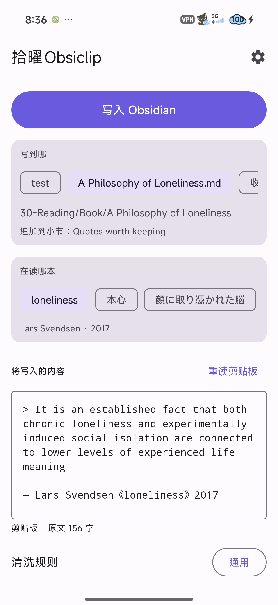
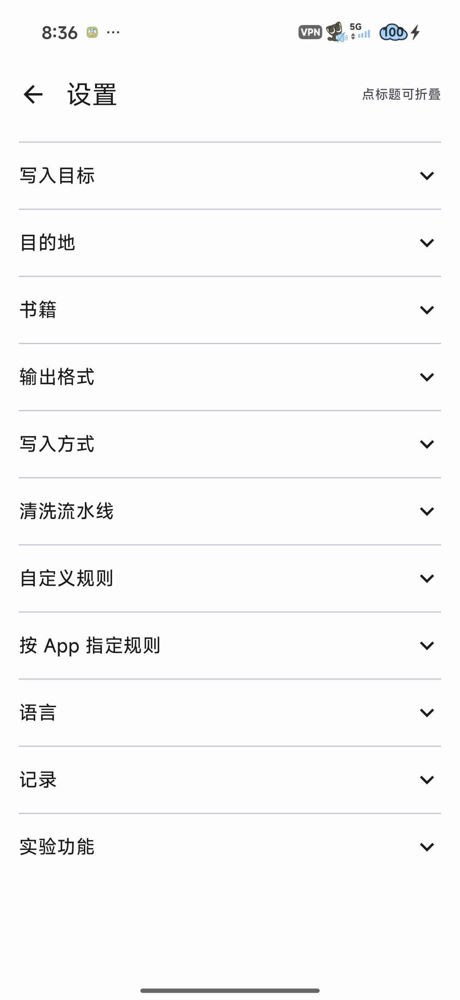
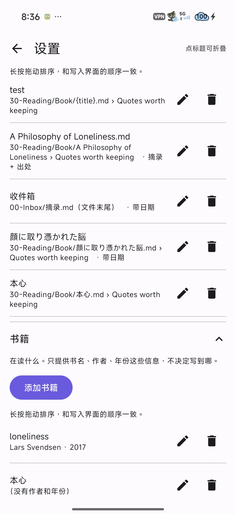

# 拾曜Obsiclip

> [English](README.md) · **中文**

一个面向**任意 App** 的 Android 分享中转工具：分享划选的一句话或整篇笔记，它会自动剔除推广杂质、套用排版模板，并精准追加写入 Obsidian 笔记库中指定的笔记与小节。

支持任何能够分享文字的软件：阅读软件（Readest、Kindle、Moon+ Reader 等）、笔记应用、浏览器及聊天工具。此外还支持系统长按菜单中的**「处理文本」**选项 —— 直接选取屏幕文字即可快速捕获，连系统分享面板都无需打开。Obsidian 自带的分享入口只能往库根目录新建孤立文件，而拾曜Obsiclip 能让你精确决定**写入哪篇笔记**、**哪个小节**以及**最终排版样式**。

**只有 Kindle 需要特殊适配**，因为它的阅读界面严格禁止分享或复制长段落 —— 详见[剪贴板通道](#分享面板受限时kindle-常见)和[从 Kindle 注解页整批抓取](#实验功能从-kindle-注解页整批抓取)。这些是针对特定软件限制的补充功能，日常使用无需繁琐操作。

界面支持**简体中文与 English** 双语 —— 默认跟随系统语言，可在**设置 → 语言**中手动随时切换。

---

|  |  |  |  |
| :---: | :---: | :---: | :---: |

## 它做了什么

很多阅读软件在分享划线时，都会强制附带一堆广告和废话（例如分享引言、购书链接、「继续阅读」推广等）。拾曜Obsiclip 内置了一套精细的清洗流水线：

1. **自动剔除垃圾外壳** —— 自动删掉分享引言行（如 `我在 … 所著的《…》中讀到…`）、`開始免費閱讀這本書：https://…` 这类推广尾注，以及纯网址行，只留下干净的引用文字本体。
2. **智能合并排版断行** —— 自动将电子书（EPUB/PDF）因屏幕宽度造成的句子断行重新拼接为完整段落（中日韩文字紧密相接不留多余空格，西文自动补齐正常空格，英文断词连字符自动接合）。对于原本就是列表或标题的内容则自动保护，绝不胡乱合并。
3. **套用模板并实时预览** —— 自动生成排版工整的 Markdown 引用（如 `> 「僕にはまだ、お母さんが必要なんだよ。」`）并追加出处信息（如 `> — 平野啓一郎《本心》 #reading`）。发送前可在界面中随时手动二次编辑。
4. **通过 `obsidian://` 协议安全写入** —— 走官方协议唤起 Obsidian 自身执行追加写入，不直接暴力读写文件系统，彻底避免破坏 Obsidian 内部的双链索引、关系图谱和搜索缓存。

> [!NOTE]
> **为什么不从文字里自动猜书名？** 很多工具看似聪明地自动猜测书名，但只要遇到一次识别失误，就会在笔记库里自动创建一篇同名的错误笔记，而正确的笔记往往就在旁边。因此拾曜Obsiclip 坚持**把“去处”和“在读哪本书”彻底分开**：在书单里录入一次书籍信息（书名/作者/年份），写到哪篇笔记、哪个标题下由目的地规则决定。平时读书只需点选对应的标签按钮即可。

---

## 使用指南

从任意应用中分享一段文字，或者长按选中文字后点击浮动菜单里的**「处理文本」→「拾曜Obsiclip」**。主界面从上到下依次为：

- **写入 Obsidian 按钮** —— 放在顶部最显眼的位置。文字分享过来时通常已经自动排版完毕，一进界面无需往下滑动屏幕，点击大按钮即可直接写入。
- **写到哪（目的地标签按钮）** —— 一排可横向滑动的目的地选项。保存路径支持 `{title}`（书名）等变量模板，一个通用的「读书笔记」目的地就能适配所有书籍。标签下方会实时显示最终解析出的笔记路径和小节名。
- **在读哪本（书籍标签按钮）** —— 另一排在读书籍选项。仅提供书名、作者、出版年份等元数据，不限制文件存放在哪里。
- **长按拖动自由排序** —— 两排标签按钮（以及设置页里的对应列表）均支持**长按左右拖动排序**，界面排布和设置顺序完全同步。
- **将写入的内容（预览与编辑区）** —— 完整展示即将追加进 Obsidian 的 Markdown 文本。发送前支持直接手动修改，修改后的内容会保留，直到你切换目的地或书籍。
- **清洗规则快捷开关** —— 界面底部提供常用清洗规则的微调开关。写入方式等基础设置收纳在设置页中，配置一次即可长期生效。

*(注：「新建笔记骨架」功能位于书籍标签栏右侧的 `+` 表单内，会自动提示将创建的目标笔记路径，防止因缺少对应小节导致写入落空 —— 若该笔记已存在请勿勾选。)*

### 分享面板受限时（Kindle 常见）

Kindle 自带的分享功能在划线较长时会直接报错禁止分享。为此应用提供了三条基于剪贴板的快捷通道（按顺手程度排列）：

1. **下拉通知栏快捷磁贴** —— 下拉手机顶部通知中心，点击「拾曜Obsiclip」磁贴，剪贴板里的文本立刻被提取进 App。
2. **打开 App 自动读取** —— 在 Kindle 复制好文字后，直接从桌面或多任务打开本 App，即可自动提取剪贴板（可在设置中关闭）。
3. **手动点「从剪贴板读取」** —— 界面内直接点击读取按钮。

三种方式的操作逻辑完全一致：在阅读软件里长按文字 → 点击**复制** → 切换回拾曜Obsiclip。Kindle 的「复制」操作也比「分享」干净得多，完全不带分享引言和购书链接。
*(注：Android 10 及以上系统限制只有当前处于前台焦点的应用才能读取剪贴板，因此必须由用户主动点击触发一次。)*

### 系统分享面板快捷直达（Direct Share）

添加过的常用目的地会自动注册为 Android 系统分享面板顶部的 **Direct Share 快捷推荐按钮**。分享时直接点击该按钮即可一键静默写入，**全程无需打开拾曜Obsiclip 界面**（自动套用上次阅读的那本书）。

### 实验功能：从 Kindle 注解页整批抓取

Kindle 在正文阅读界面禁止长选区，导致整段分享和复制均告失效。但在 Kindle 的「我的笔记本 / 标注」界面中，**所有的划线内容在系统的无障碍视图中均呈现为普通纯文本**。直接读取这个无障碍节点即可彻底绕开字数限制，无需手动长按复制。

**设置 → 实验功能 → 点击“开始抓取”** → 切换至 Kindle 打开该书的标注页 → 应用会自动匀速滚动屏幕读取整本划线 → 通过通知栏消息或设置页进入结果确认界面。

- **需要开启无障碍权限**，需在系统设置中手动授权。该无障碍服务在代码层面被严格限定为**只能读取 Kindle 进程**（`com.amazon.kindle`），绝不监控其他任何应用。
- **默认必须确认后再写入。** Kindle 列表会把长划线折叠起来，折叠后的外观和短划线一模一样。为防止静默截断造成笔记残缺不全，系统判断疑似截断的句子以及笔记中已存在的重复条目默认不勾选。
- **属于实验性功能。** 抓取逻辑依赖 Kindle 目前的页面排版结构；若后续 Kindle 界面大幅改版可能需要更新规则。

---

## 写入方式

支持两种 URI 写入通道，均已在真机上经过充分实测：

| 功能特性 / 运行表现 | Advanced URI（默认推荐） | 官方内置 URI |
| :--- | :--- | :--- |
| **是否需要社区插件** | 是（需安装 [Advanced URI](https://github.com/Vinzent03/obsidian-advanced-uri) 插件） | 否（完全不需要插件） |
| **精准定位追加到小节** | ✅ 可精准追加到指定小节末尾（如 `## 读书摘录`） | ❌ 只能追加到整个笔记文件的最末尾 |
| **超长文本处理机制** | 超过 16KB 时自动降级为剪贴板安全中转 | 超过 16KB 时自动降级为剪贴板安全中转 |
| **写入完成回调通知 (`x-success`)** | ✅ 手机端正常触发回调通知 | ❌ 手机端不触发任何回调通知 |

> [!WARNING]
> **官方文档未写明的两个真机实测陷阱：**
> 1. 官方内置 URI **若未带 `append=true` 参数，对已经存在的笔记会静默空跑** —— 不报错，但也绝对不写任何内容。
> 2. Advanced URI **当找不到目标小节标题时同样会静默失败**（连 `x-error` 错误信号都不触发）。因此对于新书，首次写入前请务必先建立包含对应小节标题的笔记骨架。

---

## 设置详解

设置页面按功能模块清晰折叠，默认收起：

- **目的地** —— 目标笔记路径、小节名称、输出格式模板及默认收件箱。路径支持 `{title}` 等模板变量。
- **在读书籍** —— 管理在图书目的书名、作者、出版年份等元数据。
- **输出格式** —— 默认排版模板 + **自定义命名格式预设**。生效优先级：**目的地选定的格式 > 清洗规则附带的模板 > 全局默认格式**。
- **写入方式** —— 切换 Advanced URI 与官方内置 URI、启动时自动读取剪贴板、写入完成后自动返回原应用。
- **写入目标默认设置** —— Obsidian Vault 库名、默认小节标题、新建目的地的默认模板路径。
- **清洗流水线** —— 各清洗处理步骤的独立开关，以及全局默认清洗规则设定。
- **自定义规则** —— 支持自己写正则表达式（包含`整行删除`与`行内替换`），支持绑定专属输出模板。**正则写错时编辑器会直接标红指出错误**，杜绝规则静默失效。
- **按 App 指定规则** —— 为特定阅读应用绑定专属清洗规则。生效优先级：**手动指定规则 > 包名自动识别匹配 > 全局默认规则**。
- **语言** —— 跟随系统 / English / 简体中文。即改即生效，切换语言绝不丢失当前正在编辑的分享内容。
- **历史记录与发送队列** —— 查看发送历史、目标路径、写入状态，支持一键重新发送及离线待发队列管理。

> [!TIP]
> **关于写入后自动返回阅读软件：** Android 系统机制决定了调用 URI 必定会把 Obsidian 唤起到前台。如果希望写完后无缝继续阅读，建议开启**「写入后返回来源 App」**。应用通过监听 Obsidian 写入完成后的 `sharetoobsi://` 回调信号（利用 `x-success`），在写入成功的瞬间自动将手机界面切回刚才的阅读软件。

---

## 开发计划与待办

- [ ] 历史记录支持按目的地和来源应用分类筛选。
- [ ] 清洗规则可视化实时测试（粘贴一段真实文本，分步查看清洗剔除效果）。
- [ ] 批量导入 Amazon Notebook 网页端导出的 Kindle 划线文件。

---

## 构建与安装

若本机环境变量中未配置 `java`、`gradle`、`adb`，请使用绝对路径执行：

```bash
export JAVA_HOME="D:/DevEnv/AndroidStudioMy/jbr"          # 或 Android Studio 内置 JBR 路径
./gradlew :app:testDebugUnitTest                          # 42 个纯逻辑单元测试（无需连接手机）
./gradlew :app:assembleDebug
"$LOCALAPPDATA/Android/Sdk/platform-tools/adb.exe" install -r app/build/outputs/apk/debug/app-debug.apk
```

- **依赖版本矩阵**：严格锁定本地 Gradle 缓存版本，支持完全离线构建：**AGP 8.2.2 / Kotlin 1.9.22 / KSP 1.9.22-1.0.17 / Compose Compiler 1.5.10 / Compose BOM 2024.02.00 / compileSdk 34 / minSdk 26**。
- **小米 / HyperOS 设备安装报错（`INSTALL_FAILED_USER_RESTRICTED`）**：这是因为系统弹出的 USB 安装确认窗口超时未点击所致，并非安装包损坏 —— 重新运行安装命令并在手机屏幕上点击允许即可。

---

## 相关文档

- 笔记存储约定、Bases 规则及 frontmatter 规范：请参考笔记库内的 `Vault Guide.md`。
- 架构设计考量、URI 细节及代码目录结构：请参考 [`CLAUDE.md`](CLAUDE.md)。

---

## 许可

[GNU AGPL-3.0](LICENSE)。可以用、可以改、可以分发 —— 但凡分发它、或把改过的版本作为
网络服务运行的人，都必须以同样的条款公开自己的源码。
